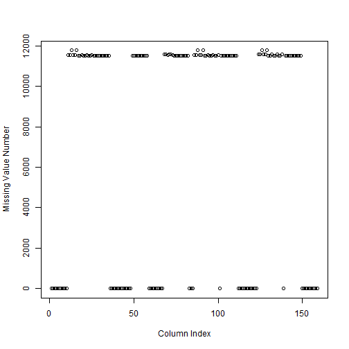
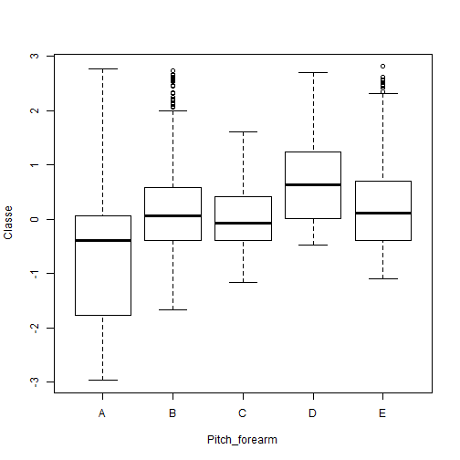
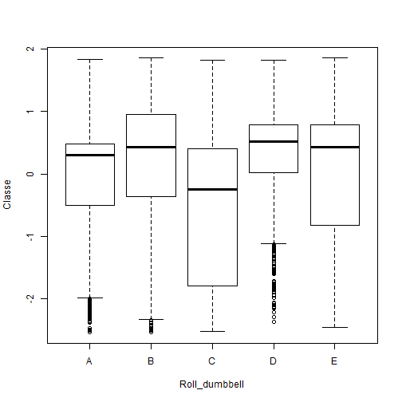
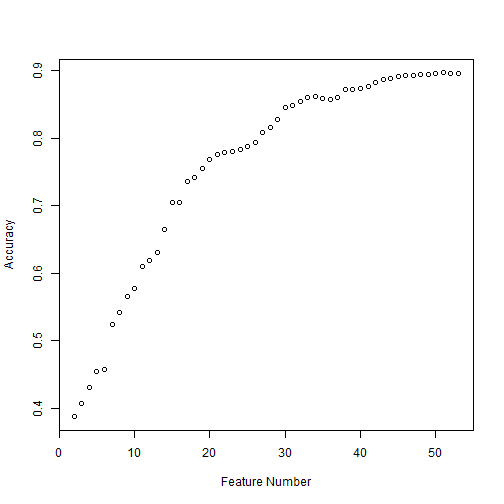

##Background
Using devices it is now possible to collect a large amount of data about personal activity relatively inexpensively. These type of devices are part of the quantified self movement. One thing that people regularly do is quantify how much of a particular activity they do, but they rarely quantify how well they do it. In this project, I focus on predicting perform barbell lifts correctly and incorrectly in 5 different ways using data from accelerometers on the belt, forearm, arm, and dumbell of 6 participants. More information is available from the website here: http://groupware.les.inf.puc-rio.br/har.


##Dataset
The training data for this project are available here: 

https://d396qusza40orc.cloudfront.net/predmachlearn/pml-training.csv

The test data are available here: 

https://d396qusza40orc.cloudfront.net/predmachlearn/pml-testing.csv

The data for this project come from this source: http://groupware.les.inf.puc-rio.br/har.

##Prerocessing
Firstly, I partition the training dataset into two parts:60% for the training set and the remaining 40% for cross-validation set. I count the missing value number for each column and get the plot as follows:
 

You can see from this plot that most columns are filled with missing values, so these variables should be deleted. Alternately, I tried to impute these varaibles with median value or mean value. But the training accuracy was very low. For lack of enough data, the imputation triggered some bias into  the dataset. It is apparent that the first five variables have nothing to do with the response. They should be also precluded.For the remaining integer and numeric vaiables, I normalize them so that they look more like Gaussian distribution. The log transformation is not appropriate for this dataset because many variables contain negative values. I also tried PCA transformation to reduce varaible number. However, the reduced dimensionality didn't improve model performance significantly, and I had to face the difficult data interpretation problem,so I gave it up at last.As a result, I include 54 variables,including 53 variables and a response.

##Explorary Data Analysis
Firstly I sort the importance of variables in a descending manner:

```
## ROC curve variable importance
## 
##   variables are sorted by maximum importance across the classes
##   only 20 most important variables shown (out of 53)
## 
##                        A     B     C      D     E
## pitch_forearm     100.00 63.22 71.40 100.00 66.38
## roll_dumbbell      52.38 60.85 83.48  83.48 57.10
## magnet_arm_x       80.70 52.70 57.80  80.70 65.26
## accel_forearm_x    79.69 48.85 63.28  79.69 46.83
## magnet_arm_y       78.89 39.28 54.97  78.89 67.48
## accel_arm_x        75.63 52.35 49.39  75.63 63.68
## pitch_dumbbell     54.50 71.42 71.42  62.88 47.20
## magnet_forearm_x   70.81 49.99 39.49  70.81 44.01
## magnet_dumbbell_x  66.97 66.97 64.24  52.10 53.15
## magnet_belt_y      65.74 57.35 58.07  61.35 65.74
## magnet_dumbbell_y  46.88 63.21 63.21  46.96 52.33
## accel_dumbbell_x   58.63 58.63 57.30  49.52 42.01
## magnet_dumbbell_z  56.58 25.13 56.58  36.77 53.48
## magnet_arm_z       54.42 54.42 38.02  43.91 52.71
## magnet_belt_z      48.92 47.69 46.16  51.26 51.26
## num_window         51.09 51.09 43.96  19.90 43.53
## pitch_arm          49.37 27.54 36.35  45.53 49.37
## magnet_forearm_y   40.06 29.30 47.94  47.94 36.97
## roll_belt          42.54 36.63 40.13  45.62 45.62
## accel_dumbbell_z   44.75 44.75 40.80  22.68 32.00
```
I make two explorary boxplots between the varaible pitch_forearm,roll_dumbbell and classe respectively, the differences between five classes are evident.

  


##Machine Learning Algorithm
I chose some learning algorithms to train the dataset. The linear algorithms seem uneffectively since this is a multiple classificiation problem. Therefore, there exists no possible linear relationship between response and predictors.Quadratic discriminant analysis is a computationally efficient algorithm to deal with nonlinear problems, and a forward selection method is introduced to select the optimal subset. The  relation between feature number and model accuracy could be seen in the following figure:
 


It is not difficult to find that nearly all variables are needed for prediction. The training result is here:

```
## Quadratic Discriminant Analysis 
## 
## 11776 samples
##    50 predictor
##     5 classes: 'A', 'B', 'C', 'D', 'E' 
## 
## No pre-processing
## Resampling: Bootstrapped (25 reps) 
## Summary of sample sizes: 11776, 11776, 11776, 11776, 11776, 11776, ... 
## Resampling results
## 
##   Accuracy   Kappa      Accuracy SD  Kappa SD   
##   0.8972448  0.8701687  0.005823497  0.007342831
## 
## 
```
This in-sample error gives an upper boundary of the out of sample error. But I think this model generalizes well in the cross validation set because I choose the training samples randomly.
The cross validation test result is listed:

```
## Confusion Matrix and Statistics
## 
##           Reference
## Prediction    A    B    C    D    E
##          A 2065   79    2    1    2
##          B   86 1262   69    6   24
##          C   30  157 1290  167   56
##          D   45    4    3 1102   34
##          E    6   16    4   10 1326
## 
## Overall Statistics
##                                          
##                Accuracy : 0.8979         
##                  95% CI : (0.891, 0.9045)
##     No Information Rate : 0.2845         
##     P-Value [Acc > NIR] : < 2.2e-16      
##                                          
##                   Kappa : 0.8711         
##  Mcnemar's Test P-Value : < 2.2e-16      
## 
## Statistics by Class:
## 
##                      Class: A Class: B Class: C Class: D Class: E
## Sensitivity            0.9252   0.8314   0.9430   0.8569   0.9196
## Specificity            0.9850   0.9708   0.9367   0.9869   0.9944
## Pos Pred Value         0.9609   0.8721   0.7588   0.9276   0.9736
## Neg Pred Value         0.9707   0.9600   0.9873   0.9724   0.9821
## Prevalence             0.2845   0.1935   0.1744   0.1639   0.1838
## Detection Rate         0.2632   0.1608   0.1644   0.1405   0.1690
## Detection Prevalence   0.2739   0.1844   0.2167   0.1514   0.1736
## Balanced Accuracy      0.9551   0.9011   0.9398   0.9219   0.9570
```
The model accuracy is about 90%, and specificity and sensitivity look great.  In fact, it predicts all twenty testing samples correctly, this fact validates model effectiveness further.

##Conclusion
In this report,I build a machine learning algoritm to predict perform barbell lifts correctly and incorrectly in 5 different ways using data from accelerometers on the belt, forearm, arm, and dumbell of 6 participants.I exclude many uncessary variables and normalize the remaining integer and numeric predicators.Then I choose the optimal subset by forward selection combined with quadratic discriminant analysis. The result confirms that nearly all variables are necessary. Finally,quadratic discriminant analysis works great among  the training, cross-validation set and testing samples.
